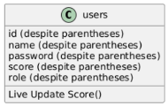
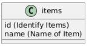
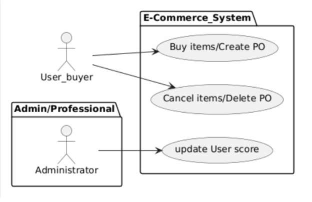

**New Module Development Documentation**

**Table of Contents**

1\. Introduction

2\. Objectives

  2\.1 The program will solve the following problems:

3\. User story

4\. Requirements

5\. API Specifications

6\. Endpoint URL: URL of the API endpoint.

  6\.1. HTTP methods: POST, PUT, DELETE

  6\.2. Request parameters: Required parameters for the request.

  6\.3. Response format: Json

  6\.4 Error handling: How to handle and return errors.

7\. Database diagram

  7\.1 Tables:

  7\.2 Field:

1\. Introduction

This document describes the steps and processes involved in developing the "update scoreboard" function and adjusting the "shopping" function for users on the E-Comerce system.

2\. Objectives

The objective is to adjust the existing system specifically to add the function of updating customer purchase points. Next, adjust the specific purchase function when completing an order, the customer will be awarded points and when canceling the order, the customer will be deducted points. Because the score update function is only for administrators, customers will not be able to use this function

  2\.1 The program will solve the following problems:

  \- Allow administrators to update the user's shopping scoreboard at any time

  \- After the user makes a purchase (successfully creates an order), the system will then award 1 point to the user

  \- After the user cancels the order, the system will then deduct 1 point from the user

3\. User stories

  \- As an administrator ("adm"), I can update the live score board

  \- As a buyer ("usr"), the system does not allow updating the live score board

  \- As a buyer ("usr"), I can create an order to purchase

  \- As a buyer ("usr"), I can Delete an order (stop purchasing)

4\. Requirements

  \- Functional requirements: Specific behaviors or functions of the module.

    \- URS 1: update User score

    \- URS 1.1:  Verify user

    \- URS 2: create purchase-orders

    \- URS 3: Delete purchase-orders

5\. API Specifications

    \- Describe the API endpoints, including:

        \- FRS 1: score: when the administrator performs this function, the system will update the user's score

        \- FRS 2: purchase-orders: API supports users to make purchases and orders

        \- FRS 3: purchase-orders: API supports users to cancel orders

6\. Endpoint URL: URL of the API endpoint.

  \- 6\.1. HTTP methods: POST, PUT, DELETE

      \- FRS 1: PUT; http://localhost:3001/score/:id

      \- FRS 2: POST; http://localhost:3001/purchase-orders

      \- FRS 3: DELETE; http://localhost:3001/purchase-orders/:id

  \- 6\.2. Request parameters: Required parameters for the request.

      \- FRS 1: request params: { id }

      \- FRS 2: request body : { itemId, quantity, userId };

      \- FRS 3: request params: { id, userId };

  \- 6\.3. Response format: Json

  \- 6\.4 Error handling: How to handle and return errors.

      \- Status: 200 OK

      \- Status: 400 Bad Request

7\. Database diagram

  \- 7\.1 Tables:

        

  \- 7\.2 Field:

      \- users Table:     id (User ID); name (User Name); password (User Pass); score (User Score);  role (User Role)
      \- purchase\_ordersusers Table: id (Identify PO); itemId (Name of PO); userId (Identify PO);} quantity (Name of PO); total (Identify PO); name (Name of PO) 
      \- items Table id (Identify Items); name (Name of Item)

  \- 7\.2 Sequence diagram:

END

